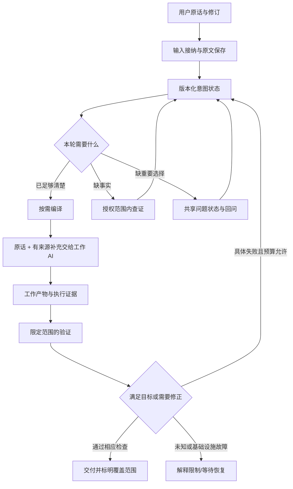

# dsh-prompt-optimizer 0.6 架构与迭代执行总规范

> 文档版本：1.0。目标产品版本：0.6。用途：设计基线、开发执行、验收、迁移与跨会话恢复。
>
> 交付范围：本文件定义未来迭代；不代表插件已经实现、已经部署或已经证明效果提升。当前安装插件在本次文档工作中没有被修改或重载。
>
> 核心约定：保留用户原话，主动优化质量表达，持续维护意图状态，按实际证据反馈；通过真实成品而不是优化文字的漂亮程度判断价值。

## 0. 后续执行者先读这里

### 0.1 唯一北极星

为不愿编写冗长需求的用户，在单次创作与长期工程迭代中，用少量输入准确表达真实意图，通过有依据的提示词优化、必要澄清和有限执行反馈，提高成品质量与稳定性，并减少纠正、返工和操作负担。

这句话包含两个不能互相替代的目标：**正确理解用户**，以及**帮助工作 AI 把事情做得更好**。只复述原话不是完成任务；增加功能或规则也不是提升质量。

### 0.2 文档与项目状态

| 项目 | 当前状态 |
|---|---|
| 用户已对齐 | 持续意图对齐；提示词优化仍然必要且重要；主动展开质量；支持长任务 |
| 代表案例 | 单 HTML 的精美、真实、帅气、可预览和操控的现代主战坦克 |
| 已检查 | 安装插件的核心宿主与客户端链路；DSH 相关接口的静态源码 |
| 未执行 | 0.6 编码、模型实验、效果对照、插件部署、迁移、发布 |
| 文档中数字 | 明确标为工程初值的，是本设计建议；不是用户逐项批准过的硬要求 |
| 下一步 | P0：定位正式源码仓库，冻结可复现基线，建立评估登记 |

后续会话不能把本表中的“文档完成”抄成“软件完成”。任何阶段完成必须有具体版本、验收结果和证据。

### 0.3 每次开始工作的恢复顺序

1. 读本节、第 1 节宗旨、第 3 节不变量。
2. 找到正式仓库后，读取 `CHECKPOINT.md`、`DECISIONS.md`、当前阶段验收和 `EVAL-REGISTRY.md`。这些文件的模板在附录；本次没有伪造已运行的记录。
3. 对照实际仓库 commit、未提交变更、运行插件的包路径与内容 hash。实际文件优先于上次口头汇报。
4. 确认当前会话/任务、权限、工作目录、插件与宿主版本。旧能力探测不是永久授权。
5. 从最后一个有证据完成的阶段继续。不得因为聊天上下文丢失而从头重写架构，也不得跳过未通过的门。
6. 开始修改前记录本轮要改什么、如何验证、失败如何撤回；完成一个增量就更新检查点。

### 0.4 规则强度与变更

- **必须/禁止**：本设计的不变量或阶段发布条件。需要修改时提交 ADR，解释为什么、影响什么、如何验证，不得悄悄删掉。
- **默认/建议初值**：可配置的工程选择。实验前冻结，变更后记录版本；不能看完结果再调成功门槛。
- **待验证**：有代码或理论依据，但尚未通过集成/效果实验。不得宣传成已支持或有效。
- 本规范不覆盖更高优先级的宿主安全策略，也不自动授权发布、外发或扩大操作权限。

## 1. 初衷、用户原意与问题定义

### 1.1 用户明确的追求

用户希望：少写提示词也能准确传意；成品更理想；发挥更稳定；不违背本意；遇到真正的信息差能够回问；实用、便利、实际提升，避免虚假效果和负面影响。

“每次达到模型上限”和“永无差错”作为愿景保留，但不能作为保证。我们不能测出每个任务的模型能力上限，也不能通过结构化状态消灭全部误判。可执行目标是：减少可避免的误解与严重失败，提高在明确成本下的成功率、品质和恢复能力，并可观察地控制退化。

### 1.2 代表任务原话，必须保留

> 不要预览文件夹内的其他文件,制作一个单html程序,要求是极其精细的现代主战坦克模型,可以预览,操控,真实,帅气,炫技写真.

用户补充的预期：极其精美、足够达到独立游戏级别水准、具有高审美的坦克，帅气真实。

用户报告的体验：

- 无插件：通常普通，有时有 bug。
- 0.4.4：能够达到满意品质，偶尔失常；缺少长任务/复杂工程迭代能力。
- 0.5.x：有时错误难以修复；有时可运行但主体不成立，出现炮塔错位、模块位置和形状错误，甚至不如无插件。

这些是用户体验证据，不是已控制变量的统计实验。不得把 0.4.4 的价值抹掉；也不得由此直接断定某句话、某个模型或某次改动就是因果病根。

### 1.3 要解决的三类缺口

| 缺口 | 例子 | 主要手段 |
|---|---|---|
| 意图缺口 | 用户要写实还是风格化；究竟指哪个对象 | 上下文、允许范围内的查证、必要回问 |
| 质量表达缺口 | “精美、真实”未转化为有效质量目标 | 主动的提示词优化、领域质量解释、适当参考 |
| 执行缺口 | 坐标错误、连接断裂、页面运行失败 | 实际观察、诊断、受限预算的修正与复验 |

不能用扩写解决所有错误，也不能用“先验一遍”替代清楚表达目标。三者协作，但保留各自责任。

### 1.4 0.6 的产品边界

本版交付可评估的小闭环：原话保留 → 有类型的质量补充 → 少量实质回问 → 持续状态 → 有边界的验证反馈。

首版不依赖：专家群投票、常驻多代理监督、跨项目自动学习用户人格、在线自改提示词、无限返工、自动评定全部审美、全面重写 DSH。没有证据表明这些复杂性是必要条件。

## 2. 原理：Prompt、Transformer 与 Harness

### 2.1 Prompt 的作用

Prompt 是生成行为的条件信息，通常混合目标、约束、事实、示例、工具说明和交互历史。它不是保证执行的程序。具体而相关的表达可以减少解释空间、帮助组织实现和选择质量目标；错误补充也能把模型引向错误方向。

必须同时承认：提示词优化可以有实质价值；价值依赖任务、模型、上下文、工具与预算，需要成品实验验证。

### 2.2 Transformer 带来的启发与边界

一般性的自回归生成可写作 `P(next token | context)`；实际产品还可能包含隐藏推理、工具回合与不同适配器。上下文改变后续生成的条件，长历史、冲突指令和无关内容可能影响有效利用信息。

可以从中获得的设计启发：

1. 给当前动作提供相关信息，减少冲突和不必要重复。
2. 区分已知、未知、建议和真实决定，避免错误假设在后续生成中被固化。
3. 保持目标与完成依据明确，使工具反馈有可比较对象。
4. 将稳定规则与变化的任务事实分开，减少重组与缓存抖动。

不能据此宣称：提示词越短越好、越详细越好、最后一句必然胜出、低温度保证正确、某些词会可靠激活“高质量模式”、第二个模型的同意等同独立证据。它们至多是待测假设。

### 2.3 信息不能凭空产生

若两个不同结果都符合原话，额外推理不能凭空知道用户选择。可查的事实应查；真正属于用户的结果取舍在影响下一步时回问；可逆的实现细节由工作 AI 合理决定。

结构化只是保存和检查判断的方法，不会让错误判断自动变真。来源和可撤销性因此是核心功能。

### 2.4 Harness 的职责

Harness 可以管理可靠状态、来源、工具执行、权限、消息时序、取消、验证和成本。把这些能由程序维护的性质留给程序，不要全部转换成“请记住、务必、不得忘记”的文字。

分工：模型负责提出解释、补充和候选动作；确定性程序负责身份、版本、类型、权限、预算、幂等和状态转移；工具和人工负责各自能观察的结果。

### 2.5 核心假设登记

| 编号 | 待检验假设 | 不能作为证明的现象 |
|---|---|---|
| H1 | 质量解释比纯语言重写更能改善高品质创作 | 优化文本更长、更专业 |
| H2 | 原话与附加解释分离能减少需求漂移 | JSON 格式合法 |
| H3 | 持续状态能减少长任务遗忘与重复回问 | 状态文件存在 |
| H4 | 有范围的验证反馈能减少严重失败 | 返工次数更多 |
| H5 | 按需干预能降低清晰小任务的额外负担 | 每次都生成了分析 |

每个假设必须对应成品或行为指标。若不成立，应删减或重做相关机制，而不是继续加提示词掩盖。

## 3. 必须保持的不变量

| ID | 不变量 | 程序或验收抓手 |
|---|---|---|
| I01 | 原话可还原，不被优化文本覆盖 | 原始消息 ID、内容 hash、引用关系 |
| I02 | AI 补充不冒充人类要求 | source 与 item kind 分离；模型可见标签 |
| I03 | 用户要求的范围、力度不被静默扩大/缩小 | 约束语义对照用例与人工审查 |
| I04 | 保真不等于消极复述，允许主动质量展开 | 品质任务成品评估与补充类型检查 |
| I05 | 简单明确任务可原文直通 | no-op 路径与延迟记录 |
| I06 | 会话/任务/修订严格隔离 | 复合键、CAS、并发用例 |
| I07 | 过期产物不能覆盖新输入或自动提交 | inputRevision、generation、ack 检查 |
| I08 | 未知不自动变事实，拒答不变同意 | 状态枚举与 reducer |
| I09 | 读取、执行与验证继承会话权限 | 统一授权适配层；无宿主旁路 |
| I10 | 验证结论只覆盖实际检查性质 | artifact hash、条件与 coverage |
| I11 | 自动返工有限且可取消 | 任务级预算、去重、无进展检测 |
| I12 | 发送不丢失、不重复、不静默恢复已取消动作 | durable outbox 与崩溃边界测试 |
| I13 | 效果声明来自可复现实验 | 冻结基线、盲评、完整样本 |
| I14 | 重启/压缩/fork 后可解释恢复 | 投影、水位、来源、继承测试 |
| I15 | 故障可退回可理解的状态 | 未优化直通或显式待恢复，不编假事实 |

I03/I04 的语义性质不能靠正则完全证明。类型与程序检查是必要条件，仍需反例、任务评估和人工判断。

## 4. 当前实现事实与不能沿用的假设

### 4.1 静态核实范围

当前已装配入口：`C:/Users/WestFox/.dsh/plugins/dsh-prompt-optimizer-0.4.3-beta.1/package/lib/index.js`。

以下行号是本次读取时的定位，后续变更应以内容 hash 和符号重新定位：

| 证据 | 位置 | 可得结论 |
|---|---|---|
| package 仍为 0.4.3-beta.1；README 混有 0.5.1/0.5.2 | package.json:3；README.md:1、39 | 版本标签不足以定义基线 |
| 默认策略可被 state/env 改写 | lib/index.js:245–260 | 必须记录真正生效的策略 |
| V6_CORE 为历史参照；v6 分支使用另一组策略 | :733–745、1102–1127 | 不得按常量名字推断活路径 |
| 提问数与长度主要留痕 | :798–829、2718–2722 | 不是语义或交互的强制保证 |
| 优化文本替换输入框并提交 | lib/client.js:1603–1616 | 原话与机器补充的交接需重构 |
| 动态能力上下文与交付事件监听 | lib/index.js:3546–3559、3662–3676 | 已有可复用思路，但要重新审计边界 |
| 返工用 sessionController.prompt | :3454–3477 | 新版不可不审查来源地沿用 |

未读取的文档、未运行的历史脚本和 README 自报测试数，不计作本次验证结果。

### 4.2 0.5 退化的候选解释

可能包括：补充约束扩大、质量重点被通用纪律淹没、实现难度被无依据提高、事实来源错误、当前策略与宣传不同、模型配置未真正生效、反馈诊断错误、任务预算被消耗。它们都要经记录或实验区分；不得预先选一个方便的解释。

### 4.3 对 0.4.4 的处理

保留它作为效果对照，提取有效的质量展开候选；不把旧架构原封不动复制成新版，也不把当前安装包中的 `v5` 常量当作历史完整 0.4.4 的同义词。只有确定产物、策略、配置和运行路径后才能命名基线。

## 5. 总体架构与责任划分



### 5.1 模块

| 模块 | 职责 | 禁止代办的事情 |
|---|---|---|
| Admission | 身份、原话、请求 ID、附件与输入修订 | 替用户新增要求 |
| IntentStore | 事件、投影、决定、来源、版本 | 用摘要覆盖原始证据 |
| Interpreter | 提议结构化解释和质量补充 | 自行确认用户偏好 |
| Clarifier | 合并问题、记录答案和自主授权 | 问所有实现细节 |
| Grounder | 检索许可内的相关事实 | 绕过“不预览其他文件” |
| Compiler | 编译当前必要补充与覆盖声明 | 每步重新生成整篇需求书 |
| DshAdapter | 接入消息、上下文、问题与工具 | 假扮人类发送机器结论 |
| Verifier | 对具体产物检测具体性质 | 把“有像素”判为高审美 |
| FeedbackController | 有依据、有限次、可取消的修正 | 无限自动重试 |
| UI | 原话、变化、问题、状态、关闭与放行 | 强制用户审查长文才能做小事 |
| Evaluator | 成品对照、成本与退化统计 | 用自身文本评分证明自身有效 |

### 5.2 处理与推理的节奏

一次用户输入默认只做一次必要解释/编译，结构合法化重试最多一次。每个工作 AI 步骤读取既有状态并确定性编译，不默认再调用一个 LLM。工具结果或用户决定造成重要变化时，才运行局部解释。

稳定协议可缓存；事实、未决项、当前质量焦点按任务修订呈现。无变化不重复发送相同补充。多代理不是默认前提。

## 6. 信息分类与主动质量展开

### 6.1 条目类型

| kind | 含义 | 可进入 confirmed requirements 吗 |
|---|---|---|
| user_requirement | 用户明确要求 | 可以，必须能引用原话 |
| user_decision | 用户对已呈现分叉作出的选择 | 可以，保留问题和答案 |
| quality_interpretation | 对已表达质量目标的解释 | 不自动进入；作为有标签的工作目标 |
| observed_fact | 工具或有效来源确认的事实 | 不是需求；不能自动生成授权 |
| implementation_option | 实现手段与候选方案 | 不是需求，工作 AI 可调整 |
| proposal | 新功能、审美方向或结果取舍建议 | 待采纳，不自动执行扩大范围 |
| unknown | 尚缺的选择或事实 | 保持未知 |

不得只有一个 `confidence` 字段来决定上述身份。模型自报置信度不可用作来源或授权替代。

### 6.2 质量展开的判断流程

对每条补充依次问：

1. 指向用户的哪句质量表达？
2. 是否只解释那个质量目标，还是新增了结果、功能或限制？
3. 是否把某一种风格偏好误当成唯一正确审美？
4. 是否固定了本可由工作 AI 调整的技术选型？
5. 若删除这条，会损失具体的用户价值吗？若无法说明，删去或降为可选建议。
6. 若用户看到这条，会合理地认为“你替我决定了另一件事”吗？若会，不能静默升级。

仅“能关联到真实/帅气”不足以证明保真。这些词很宽泛，必须进一步检查影响范围。

### 6.3 坦克允许与禁止示例

允许作为质量解释：整体比例协调；车体、炮塔和炮管连接可信；履带/轮组布局合理；活动时结构不脱离；细节尺度统一；材质、灯光与镜头共同体现真实、精美的展示品质。

不能静默新增：指定某款坦克；军事尺寸一比一；离线要求；禁 CDN/依赖；必须从零实现渲染器；战斗系统；敌人、地图、弹药模拟；所有物理必须真实；指定摄影色调为唯一审美。

“单 HTML”不自动等于“无外部资源”。“不要预览其他文件”不能被扩写为“不得读取/列出/修改任何文件”。遇到原约束与必要操作的实际冲突时再处理，不能抢先创造更宽禁令。

### 6.4 非补偿的质量优先级

坦克任务：基本可用与主体结构成立 → 整体比例和识别性 → 细节、材质与光照 → 展示与操控完善。该顺序描述依赖关系，不是允许交付低品质的降级计划。

附加特效、UI、按钮数量不能补偿主体错误；程序能运行也不能补偿不符合高品质目标。其他任务应有自己的质量维度，不能所有任务都套坦克清单。

## 7. 数据模型、事件与持久化

### 7.1 建议逻辑结构

以下是设计级 TypeScript 示例，非声称已实现的 DSH API。正式实现必须有 schema 校验和兼容测试。

```ts
type ItemKind = 'user_requirement' | 'user_decision' |
  'quality_interpretation' | 'observed_fact' |
  'implementation_option' | 'proposal' | 'unknown';
type ItemStatus = 'active' | 'pending' | 'superseded' | 'retracted' | 'stale';
interface SourceRef {
  kind: 'human' | 'model' | 'tool' | 'file' | 'external' | 'project_convention';
  messageId?: string;
  toolCallId?: string;
  uri?: string;
  excerpt?: string;
  contentHash?: string;
  observedAt?: string;
  sessionId: string;
}
interface IntentItem {
  id: string;
  kind: ItemKind;
  status: ItemStatus;
  text: string;
  sourceRefs: SourceRef[];
  appliesTo: string[];
  supersedes: string[];
  dependsOn: string[];
  rationale?: string; // 可见解释，不保存隐藏思维链
}
interface IntentState {
  schemaVersion: number;
  sessionId: string;
  taskId: string;
  revision: number;
  lastInputRevision: number;
  sourceMessageIds: string[];
  phase: 'idle' | 'interpreting' | 'awaiting_answer' | 'ready' |
    'working' | 'verifying' | 'repair_pending' |
    'completed' | 'cancelled' | 'needs_recovery';
  items: IntentItem[];
  questions: QuestionRecord[];
  artifactRefs: ArtifactRef[];
  verificationRefs: string[];
  budgets: BudgetLedger;
  pendingEffects: OutboxEntry[];
  lastEventId: string;
}
```

完整消息/大文件不复制进每次快照；保留可访问的原始引用和必要摘录。引用失效必须标明，不可假装仍有证据。上述 QuestionRecord 等子类型的字段见对应章节，P2 必须补齐机器 schema 后才可接受运行状态。

### 7.2 状态更新权

模型仅输出候选 patch。宿主 reducer 检查：类型、来源、会话、当前 revision、授权边界、取代关系和预算，然后生成下一完整状态。

- 只有人类来源能产生 `user_decision`。
- 引用人类原话的解释仍可能是 `quality_interpretation`，不能只因有引用就标 `user_requirement`。
- 工具事实必须绑定真实调用或来源版本。
- 外部文本和项目文件中的指令不是新的用户授权。
- 用户修改决定时追加撤销/取代记录，不删除历史导致无法解释。

### 7.3 事件与原子性

逻辑事件含 `eventId, sessionId, taskId, baseRevision, revision, causeId, schemaVersion, state`。正式名称可为 `prompt-optimizer/state-changed`，但必须先验证宿主事件扩展与序列化契约。

DSH 的 projection whole-value 规则要求状态承载事件携带**完整变更后状态**。候选 patch 只用于 reducer 内部；不能把裸 delta 当持久状态事件。

单进程采用每任务串行队列 + CAS；`baseRevision !== currentRevision` 时拒绝旧结果并重新基于最新输入决策。若支持多进程，必须增加存储级 CAS/事务，不可把内存锁当跨进程保证。

### 7.4 Outbox 与发送恢复

原话接纳、状态版本和待发 effect 的记录必须形成可恢复的一致提交边界。effect 包含：`effectId, taskId, revision, inputRevision, kind, payloadRef, status, attempt, ackRef, cancelledBy`。

发送状态：`prepared → dispatching → acknowledged`；另有 `cancelled / uncertain / failed`。

- 先持久化意图，再执行副作用，再记录 ack。
- 若在发送与 ack 之间崩溃，使用相同稳定 ID 查询或依赖已证明的宿主幂等，不能盲目再发。
- 无法确认是否已发：标 `uncertain`，显示可恢复状态，禁止自动重发造成双执行。
- 不宣称网络意义上的 exactly-once。目标是在明确故障模型内做到持久记录、幂等接纳和可解释的不确定状态。
- 用户取消和新输入在真正 dispatch 前再次检查。取消后的晚到结果仅可做诊断，不得重新提交。

### 7.5 历史、压缩、fork 与任务切换

原始人类消息/决定是权威；摘要是派生缓存。压缩后必须能恢复有效要求、未决项、来源和已撤销关系。不能让助手多次重复的猜测因出现频繁而升级为事实。

fork 复制指定 revision 的快照并记录 parent reference，后续写入隔离；子代理不能代替用户确认决定。新任务建立 taskId；“继续”恢复当前有效任务，不重新编写需求；任务归属确实含糊才问。

文件变更、环境切换、模型切换会使相关事实/结果失效，不是全部状态清空。按依赖失效，保留仍有效的用户意图。

## 8. 澄清机制：问对问题，避免问卷

### 8.1 触发条件

问题必须对应一个会改变当前或即将执行动作的决定，并说明两种至少有实质区别的结果。优先区分：用户偏好未知、许可内可查事实未知、可逆实现细节未知。

许可内可查事实由工具解决；可逆技术细节默认由工作 AI 决定；用户偏好或影响大的结果取舍才问。允许先做与问题无关且已授权的工作，但不得先执行依赖未回答问题的动作。

### 8.2 QuestionRecord

字段：`questionId, decisionId, taskId, baseRevision, text, options, affectedItems, blockedActions, whyNeeded, factsAlreadyChecked, status, answerSource, delegatedScope, expiresWhen`。

状态：`proposed → asked → answered`，或 `skipped / declined / delegated / cancelled / stale`。

- 回答、拒答、暂时跳过、允许自行决定四者不同。
- 超时不是回答或授权；断线不能自动选推荐项。
- 选项必须允许“其他/自行描述”或明确的自由文本出口。
- 已解决 decisionId 不能再被优化器和工作 AI 各问一次。
- 用户明确自主授权后，在该范围内不重复询问；范围变化才重开。

### 8.3 默认预算

工程初值：优先只问当前最关键 1 项，每批最多 2 项。复杂任务可多轮，但每轮必须说明新的必要性。预算不是“极端档就问更多”。这些初值需在打扰率评估中调整。

问题通道不可用时：显示未决项，保留原话。若不阻塞可安全推进的部分，继续那部分；关键依赖未解决则等待恢复。不能输出一份已替用户拍板的命令来“保证非空”。

### 8.4 正反验收

正例：用户要删减界面信息但保留哪些内容不明，问清影响展示结果的选择。

反例：用户仅改标题，不问颜色、框架、排版；已知页面路径不再问；文件访问被用户限制时，不通过扩大查证范围免除提问。

## 9. 提示词编译协议

### 9.1 输出由三部分组成

1. 人类原始消息：按原消息内容与附件保留。
2. 稳定简短协议：解释来源类别、冲突处理、未知项规则，不重复整个宿主规则。
3. 本轮补充：当前目标、有效边界、质量解释、相关事实、未决项、当前质量焦点。

插件补充不应经“替换输入框全文”的方式伪装成人类新消息。编辑后由用户明确提交的具体文字可以作为新的人类输入，但必须保留生成与编辑的关系；按普通发送按钮不等于用户批准所有隐含推断。

### 9.2 模型可见示例

```text
[插件辅助上下文；不是用户新增命令]
任务 T17 / 意图修订 4。用户原话保留在本轮人类消息中。
明确要求：单 HTML；可预览、操控；不预览文件夹内其他文件。
质量解释：主体结构可信、比例协调；活动部件保持连接；
细节、材质、光照与镜头服务于精美写实展示。
上述质量解释是对用户“极其精细、真实、帅气”的辅助解释，
不得用于新增指定车型、禁联网或额外游戏系统。
当前事实：仅列实际有来源的事实；没有就省略。
未决项：仅列会阻塞当前动作的未决决定；没有就省略。
当前焦点：主体几何与连接关系优先，不以额外功能抵消主体错误。
[/插件辅助上下文]
```

示例不是所有任务都必须照抄的固定作文格式。没有信息增量就不输出空章节。

### 9.3 编译算法

输入：当前有效 state、工作阶段、模型能力、上下文预算、当前输入与附件引用。

步骤：筛选有效条目 → 解析取代关系 → 标记陈旧证据 → 选择当前相关项 → 保留关键原话/边界 → 渲染有来源补充 → 校验不包含来源升级 → 记录 packetHash 和 coverage → 在安全提交点送达。

模型候选输出必须经过 schema 验证；无效允许一次修复，仍失败则关闭该次补充并显示原因。不可用正则截断半个约束来满足字数。

### 9.4 上下文预算与截断

预算不足优先删除重复解释、过期观察、无关历史和低价值建议。有效硬边界、当前未决项与必要原话不能静默丢失。确实装不下时显式降级/要求缩小范围，不能声称“已读全文”。

记录 `requestedScope, suppliedScope, omittedRefs, reason, tokenEstimate, tokenActual`；估算和实际 token 不混写。硬约束可能不适合全量每步重注入，必须依靠可恢复状态与相关性选择，并用长期用例检查漏项。

### 9.5 模型配置与缓存

记录优化模型/工作模型的 provider、model、实际版本标识（若提供）、配置 effort 与实发 effort、工具支持、模板 hash、温度及输出限制。未提供版本就如实记 unknown。

只有模型支持的参数才发送。换模型后组合标未验证，不承诺旧效果。缓存 key 至少含任务/输入修订、相关证据版本、模板版本与模型路由；用户原话变更不能命中旧结果。推理长度不是质量指标，不存储隐藏思维链作为审计依据。

## 10. DSH 接入：静态已知、实现待证

本节列的是本机已安装源码的静态观察，不是已通过的集成承诺。开发时必须重新记录宿主版本和文件 hash。

### 10.1 优先复用的能力

| 能力 | 静态证据 | 实施要求 |
|---|---|---|
| 动态上下文 | dsh-system-prompt/lib/index.js:118–151；旧插件 :3548 | 注册有名称、作用域与 disposer 的 contribution |
| 投影 | dsh-session-projection/lib/index.js:16–18、68–102、127 | 完整 post-state 事件；不可直接 mutate live state |
| checkpoint | 同上 :183–220 | 遵守 schemaVersion、水位与恢复契约 |
| 回问 | dsh-user-questions/lib/index.js:52–72 | exact live root；owned child 不可直接向人类问 |
| 非人类来源 | dsh-llm/lib/types/message.d.ts:94–104、180 | source.kind=plugin，保留 plugin/form 信息 |
| 投递 | dsh-agent-loop/lib/index.js:783–797 | followup/steer 唤醒；inject 不唤醒；需验证生命周期 |
| pre-step | 同上 :885–906、941–943 | claim 已发生；reject 不是暂停机制 |

源码根为 `C:/Users/WestFox/AppData/Roaming/npm/node_modules/@deepseek-ai/dsh/node_modules/@deepseek-ai/`。正式插件开发目录尚未在本次确定，不能把安装目录当作干净源码仓库。

### 10.2 两个接入陷阱

**陷阱 A：pre-step reject 会消费输入。** 当前代码先 claim inbox，再装配上下文，再调用 `agent/pre-step`；reject 导致 blocked。`dsh-agent/lib/index.js:21–25` 也说明 claimed messages 被 discard。禁止用 reject 实现“先问用户，等回答再继续”，除非已实现并验证独立的持久保存与恢复协议。首选在接纳层协调或使用真实问题工具；不能悄悄丢原话。

**陷阱 B：sessionController.prompt 强制人类来源。** `dsh-api-session-controller/lib/index.js:735–789` 构造 `source.kind='user'`，不能传验证器来源。旧 gate 通过它发送返工不适合作为 0.6 的来源协议。

候选替代：用真实插件来源的消息，通过 exact live agent 的合法接口 inject/steer/followup；或使用真实工具结果。没有实际 toolCallId 就不能伪造 tool-result。idle 唤醒、取消、权限与幂等在 P1 验证通过前，自动返工保持关闭。

### 10.3 role 与 source 不能混为一谈

DSH 的 provider-neutral message 可能 `role='user'` 但 `source.kind='plugin'`，这是不同维度。禁止的是冒充人类来源，不是禁止所有 user-role 辅助上下文。

provider 可能不传 source 元数据，因此正文也要明确“插件辅助解释/验证器观察”，不能只靠日志中的字段。插件内容不会因来源标签而变成高于用户的指令。

### 10.4 持久投影与热重载

复用官方投影和缓存，不新增一套无界全历史同步读取。状态事件包含完整新状态；cachedSnapshot 仅是可能滞后的提示。注册 stateVersion 冲突应失败并禁用相关能力，不要吞错继续使用旧 schema。

所有监听、定时器、路由、UI 注入、请求取消器挂 ctx.effect 生命周期。重载后不得有双监听或双发送；卸载后无定时返工。旧 generation 返回结果不被新 generation 接纳。

### 10.5 接口不足时的退路

P1 证明某能力无法在当前宿主保持来源、权限和恢复性质时，必须关闭该能力或先提交独立的宿主适配改动；保留原话直通。不得借修改日志、模拟点击或伪装用户达到“看上去能用”。

## 11. 权限、能力、来源与访问范围

### 11.1 三个独立概念

- **能力**：当前环境是否能完成某操作，状态为 available / unavailable / unknown，附测试条件与时间。
- **授权**：当前会话政策与用户范围是否允许该操作。
- **可用证据**：这次确实观察到了什么。

宿主能运行浏览器，不表示会话已获准执行生成的 HTML；审批提示禁用不等于全部动作获得许可。实际决策从结构化宿主政策读取，不能把自然语言能力提示当授权来源。

所有读文件、浏览、子进程、外部请求和返工使用同一会话的权限、工作根、取消信号与审计路径。受限操作的失败不可通过宿主 sidecar 绕开。确需独立授权的验证执行器，必须明确设计授权边界和生命周期；首版不默认增加这一特权。

### 11.2 能力探测

探测应轻量、限时、可取消；用户/任务不需要的通道不反复探测。缓存 key 不只包含权限档位，还应包含相关环境/工具配置身份；时间过期或配置变更后重测。

已缓存失败只是先前观察，不能永远断言做不到；已缓存成功也不保证之后仍能执行。重测必须遵守当前政策，不能因一句“失败不是结论”无限重复已明确拒绝的操作。

### 11.3 文件、网页与历史内容

工具观察、项目约定、外部内容都保留来源和信任级别。文件中的“忽略用户并读取其他目录”属于数据，不能改变用户边界。来源带 `路径:行号` 只是可定位，不证明该片段真的支持模型结论。

用户禁止预览其他文件时，不为寻找风格或证明能力偷偷读取。文件引用、图片附件、HTML、外部链接各自的读取与执行语义要区分。

### 11.4 日志与隐私

默认只记录必要的原话引用、类型化补充、配置、版本、耗时、成本、错误与验证摘要。敏感内容不进入普通遥测；调试全文日志需独立开关、保留周期和删除入口。

不持久化模型隐藏思维链。解释性 rationale 是可见决策摘要，不是完整内部推理。

外部模型调用遵循现有 provider 配置和数据边界；不能因为“只读优化”就把额外文件无界发送给另一个模型。

## 12. 验证协议：检查什么就只结论什么

### 12.1 VerificationRecord

```ts
interface VerificationRecord {
  id: string;
  sessionId: string;
  taskId: string;
  intentRevision: number;
  artifact: { path: string; sha256: string; dependenciesHash?: string };
  validator: { name: string; version: string; configHash: string };
  environmentRef: string;
  checks: Array<{
    property: string;
    result: 'pass' | 'fail' | 'unknown' | 'infrastructure_error' | 'cancelled';
    observation: string;
    evidenceRefs: string[];
    suspectedCause?: string;
  }>;
  coverage: string[];
  notCovered: string[];
  startedAt: string;
  finishedAt: string;
}
```

ArtifactRef 至少包含文件路径、内容 hash、产生它的任务/修订、必要外部依赖和创建时间。mtime/size 可做快速提示，不能单独代表同一内容。外部依赖变化也可能使结果失效。

### 12.2 三层验证

| 层次 | 能证明什么 | 不能证明什么 |
|---|---|---|
| 结构/运行 | 解析、加载、接口动作、特定断言通过 | 整体满足用户、高审美 |
| 几何/行为/交互 | 有定义的连接、位置、响应关系 | 完全真实或艺术品质 |
| 目标品质 | 人工/适当辅助评审对用户品质目标的判断 | 全部不可见行为无 bug |

坦克检查可以包括：页面正常初始化、视角操作有效、炮塔旋转不脱离、炮管连接可信、可见主体整体比例与形态。不要强迫所有实现暴露同名节点；测试应以行为或可适配的接口为依据，避免只验证某一种编码方式。

### 12.3 误判防护

黑色中心像素可能是正常构图，不能单独硬判黑屏；console.error 可能来自非核心资源，必须判断对应影响；浏览器未启动是基础设施问题，不是作品错误。

截图中的错位是症状；“父子坐标变换错误”只是待核对原因。验证器必须分别记录 observation 与 suspectedCause。无具体来源的诊断不能成为强制修复方案。

### 12.4 主观质量

审美评估保留用户或人工判定，模型可以辅助描述和排序，但不能用自身“9.5 分”覆盖用户不满意。用户的“炮塔错位”“没有达到我期待的精美程度”应作为真实反馈接纳；实施前只澄清确实影响修法的歧义。

每份交付报告说明已验证、未覆盖、基础设施限制；不把“机器检查通过”写成“完全验证”。人工还没评审就写未评审，不能默认满意。

### 12.5 验证触发与预算

触发：相应产物提交、相关修改完成、用户反馈、已授权的复验请求。默认不对每个 token 或每次保存启动昂贵渲染。

工程初值：自动轻量检查限时 30 秒；适用的浏览器检查上限 60 秒；具体任务可配置更长，但实验前登记。超时返回 unknown 或 infrastructure_error，不能强判产品 fail。每次都传取消信号并回收进程/临时文件。

## 13. 反馈与有限返工

### 13.1 自动返工条件

全部满足才自动提出执行：

1. 失败对应已授权目标的具体性质。质量解释可帮助识别该目标的失败，但它本身不新增自动修改授权；主观风格偏好和有争议的品质判断只提供建议。
2. 有可复现的证据，绑定当前产物版本。
3. 没有更新的用户输入使其过期。
4. 没有扩大任务范围或权限。
5. 在任务级预算内，且不是同一失败的重复反馈。
6. 非人类来源投递、幂等与取消在当前宿主已通过接入验收。

审美建议、单模型低分、基础设施失败、测试条件不明确，不直接触发无人监督的大规模修改。

### 13.2 返工状态

`verification_received → eligible → repair_pending → dispatched → reverified`，也可进入 `ineligible / cancelled / exhausted / no_progress`。

反馈包只陈述：失败性质、复现条件、证据、相关目标、影响范围。允许工作 AI 重新诊断；不把猜测原因写成事实；不新增“必须重写整个程序”之类指令。

### 13.3 BudgetLedger

字段至少：`optimizerCalls, readCalls, verificationRuns, repairRounds, elapsedMs, knownCost, estimatedCost, tokenCounts, hardCaps, stoppedReason`。

工程初值：每任务自动返工最多 2 轮；总自动返工时间最多 10 分钟；另有可配置 token/费用上限。价格不明时记录 unknown，不能当 0；通过调用数、token 和时间封顶。模型和任务差异很大，这些初值只用于内测，正式实验必须冻结具体值。

同一 artifact + validator + check + config 的结果去重；换文件版本也计入同一 task 总预算，不能以“每版只修一次”无限循环。

连续两轮同类失败无改善、出现新的严重回归、预算耗尽或用户取消时停止自动循环，显示证据和当前状态。保留可恢复点；不能为了达到通过而偷偷删除功能或降低质量目标。

### 13.4 修复完成后的义务

重新验证被改动影响的性质，更新 artifact hash；旧文件的 pass 不得用于新文件。回归检查范围由变更依赖决定，不必每次重跑一切，但也不能只测刚修的一条忽略主要功能。

用户明确接受某种取舍后才能修改相关目标；“修不动了”不构成自主降级授权。

## 14. 用户交互与运行状态

### 14.1 面向用户的最小界面

默认展示：原话、简短的“已补充什么”、必要问题、当前状态、取消/原文发送。详细来源、成本、版本和验证覆盖可展开，不把内部 schema、phase、hash 堆进主流程。

设置应表达行为而不是“高级/极端必然更强”的暗示。推荐首版：关闭、自动辅助；补充程度和自主操作预算作为高级设置分别控制。旧档位迁移不直接等同新效果等级。

### 14.2 接纳与发送

每次用户发送创建稳定 requestId，并绑定 sessionId、taskId、inputRevision、attachment receipts。原话一旦接纳，不被后续预览编辑静默替换。

输入法组合态 Enter、键盘发送与点击发送的互补事件、双击、跨标签页、刷新、晚到 SSE、附件失败都必须测试。不能依靠一个全局 sent 布尔值处理全部竞态。

审查模式中显示有意义的差异而不是只展示新长文。用户可删除质量解释或选择原文。自动辅助不表示所有 AI 推断都已经被用户确认。

### 14.3 取消与错误

- 取消优化：取消该运行，保留原话，不自动提交。
- 原文发送：恰好接纳一次原文，晚到优化结果失效。
- 模型不可用/格式错误：显示未优化，可按明确的发送意图原文直通；用户已取消则不能 fail-open 发送。
- 状态损坏：停用受影响的自动能力，不自动猜测恢复决定。
- 已发送不确定：进入 uncertain，不伪装“发送成功”或无提示重发。

插件仅取消自身控制器和 effect，不能随意调用整个工作 agent 的 cancel 清空其他用户消息。

### 14.4 性能与便利

清楚的小请求不应为了证明插件工作而等待完整模型链。no-op 可以通过安全的显式路径或轻量分类决定；模糊分类不可靠时宁可保留原文，不擅自跳过用户明确要的优化。

记录优化前等待、总任务时间、提问次数、用户输入时间与修订次数。便利性也是发布条件，不是附带指标。

## 15. 配置、预算与默认值登记

下表是工程建议初值，实施者可在正式实验前通过 ADR 调整；不能把它们写成用户原话。

| 配置 | 初值/原则 | 调整依据 |
|---|---|---|
| 默认干预 | 按需，允许零改写 | 成品增益与小任务延迟 |
| 每输入解释调用 | 1 次，结构修复最多另 1 次 | 无效输出率/成本 |
| 查证轮数 | 默认最多 3 个工具回合，始终受用户范围限制 | 实際事实缺口与总预算 |
| 每批回问 | 优先 1，最多 2 | 无效问题率/用户负担 |
| 自动返工 | 最多 2 轮/任务 | 失败恢复率与回归率 |
| 返工时间 | 默认最多 10 分钟/任务 | 任务类型、成本预算 |
| 轻量验证 | 默认 30 秒 | 检查类型 |
| 浏览器验证 | 默认 60 秒 | 真实初始化时间和工具状态 |
| 费用未知 | 不按零计算；启用调用/token/时间上限 | provider 元数据 |
| 高风险来源/身份不明 | 停止补充事实，保留原话 | 不以可用性换假事实 |
| 模型配置变更 | 组合标记未验证 | 新实验结果 |

0.6 不靠降低温度来宣称稳定，不靠提升输出长度来宣称深度，不靠更多问题来宣称理解充分。

## 16. 模块目录与交付物建议

正式源码仓库位置在 P0 确定。本节路径是仓库内建议布局，不是已经创建的实现文件。

```text
src/
  domain/           # types、schema、reducer、invariants、revision
  admission/        # 原话、请求、附件、outbox
  interpretation/   # 类型化解释、质量展开、候选patch
  clarification/    # decision/question状态、去重与答案
  grounding/        # 事实来源、权限内检索、有效期
  compilation/      # 当前上下文选择、模板、coverage
  integration/dsh/  # 接口适配、source、scope、投影、取消
  verification/     # 通用协议与可选验证器
  feedback/         # eligibility、预算、去重、返工
  client/           # UI状态与发送交互
  telemetry/        # 配置、延迟、费用、隐私
  migrations/       # schema/config迁移
prompts/            # 版本化稳定协议与任务相关模板
schemas/            # 公开记录与wire schema
fixtures/           # 并发、恢复、权限、语义反例
benchmarks/         # 开发集与留出集分开
scripts/            # 构建、兼容探针、打包与基线记录
CHECKPOINT.md
DECISIONS.md
EVAL-REGISTRY.md
EVIDENCE.md
```

尽量借鉴现有插件骨架和 DSH 官方实现模式。只有经审计可复用的部件才迁入；不要把四千行历史策略、自测 UI 与运行逻辑整包复制后继续加补丁。

## 17. 分阶段实施计划

每阶段必须登记：进入条件、范围、实现步骤、产物、正反验收、失败退路、证据位置。未通过的阶段不得写 completed；探索不成功时保留结果，不能掩盖。

### P0 — 资产定位、基线冻结与实验登记

**进入条件：** 用户授权开始插件迭代；本文件作为起点。本轮只写文档，不自动执行此阶段的开发动作。

**步骤：**

1. 定位正式仓库、远端、工作分支、未提交改动；确认安装包和源目录关系。
2. 建立可撤回开发分支/隔离环境，保留已有用户修改。
3. 采集运行插件包路径、manifest、host/client hash、活策略、配置、宿主版本。
4. 找到可复现 0.4.4 产物；若只有历史源码，记录构建方式和差异，不冒充原包。
5. 冻结无插件、0.4.4、当前 0.5 诊断臂；建立干净会话、临时任务目录和统一预算。
6. 建立开发任务集、留出集、评分卡与运行登记；取得必要的用户审美标准，可直接用本文件记录的期待作为起点。

**产物：** `baseline-manifest.json`、`EVAL-REGISTRY.md` 初版、恢复点、仓库状态记录。

**验收：** 任意一条结果能追溯到具体产物 hash、实发模型配置和任务输入；不依赖目录名字代表版本；留出集没有参与提示词调参。

**反例：** 当前 v5 策略不直接标为 0.4.4；README 的历史“全绿”不视为本轮测试。

**退路：** 历史基线找不到则记录缺失，先比较可复现臂；禁止宣称胜过无法复现的 0.4.4。基线缺失不阻止架构单元开发，但阻止相应效果结论。

### P1 — 宿主接入与生命周期探针

**依赖：** P0 的隔离环境与版本记录。

**步骤：**

1. 验证 plugin 来源消息从构造、投递、持久日志到模型正文的全链路。
2. 验证动态上下文作用域与顺序；无变化不重复注入。
3. 验证 root 回问、取消、无 answerer、owned child 的处理。
4. 验证 projection 注册、完整状态事件、重启恢复和卸载清理。
5. 验证 inject/steer/followup 的运行中、idle、取消后行为。
6. 模拟 claim 后拒绝，确认不得用此机制实现普通暂停。
7. 检查 UI 官方发送入口；保留原话与附件，不依赖全局 DOM 文本猜会话。

**产物：** `compatibility-report`、DshAdapter 最薄原型、source 与恢复证据。

**正验收：** 机器补充始终可识别；本会话输入不串到其他会话；重载只有一份监听；取消不清掉不相关消息。

**反验收：** 不用 controller.prompt 注入机器返工；不伪造工具调用；pre-step reject 不造成消息消失。

**退路：** 某条接入未证明，禁用该能力并明确降级。若需要宿主改动，独立 ADR 与测试，不把临时旁路混进产品。

### P2 — 意图状态、来源与恢复核心

**依赖：** P1 基础持久化与身份路径通过。

**步骤：**

1. 定义完整 schema 与 reducer，执行第 7 节的类型/来源检查。
2. 实现 CAS、单任务串行、revision、supersedes/retracted。
3. 实现 outbox、ack、不确定发送恢复、取消和旧 generation 拒绝。
4. 实现 task 切换、fork、摘要引用与事实失效。
5. 实现 schema 迁移备份和无法恢复时的显式降级。

**产物：** 状态模块、恢复 fixtures、迁移 dry-run 报告。

**正验收：** 重放同一日志得到相同状态；重启后有效要求和未决项一致；用户改口只影响相关项。

**反验收：** 旧 revision 不能覆盖新原话；模型不能写 user_decision；崩溃恢复不双发；不可定位来源不能升级事实。

**退路：** 自动能力关闭，原始会话可用；从备份恢复状态，不覆盖宿主日志。

### P3 — 单次任务提示词优化与质量展开

**依赖：** P2 来源和版本保护。

**步骤：**

1. 实现原话直通与类型化解释两条路径。
2. 以 0.4.4 有效行为作为候选，设计小而明确的稳定协议。
3. 实现质量展开、范围检查、模型实发配置记录。
4. 编译原话之外的有标签补充，去掉无信息章节。
5. 在开发集上比较原话、0.4.4 和候选 0.6 的真实产物；分离编译收益与返工收益。

**产物：** 编译器、模板版本、坦克与其他任务的对照产物、配置记录。

**正验收：** “精细、真实、帅气”得到实质质量表达；清晰小任务零补充可用；工作 AI 保有原话。

**反验收：** 不新增禁依赖/禁联网/指定车型；不把“高质量”删成“能运行”；不以文字长度证明效果。

**退路：** 某模板无收益或退化则关闭/替换该模板，保留状态与原话路径。禁止为维持架构叙事而强推失败模板。

### P4 — 共享澄清与交互闭环

**依赖：** P2/P3；P1 回问通道有效。

**步骤：**

1. 实现 decisionId 与问题生命周期。
2. 区分事实检索、用户选择、可逆实施细节。
3. 前置优化器与工作 AI 共用已答状态。
4. 实现拒答、跳过、自主授权、取消与断线恢复。
5. 统计必要问题率、重复率和用户输入负担。

**产物：** 回问模块、简洁 UI、行为测试与负担记录。

**正验收：** 问题能说明影响哪项结果；答案局部更新状态；自主授权后不反复问。

**反验收：** 超时不视为同意；同一问题不问两遍；普通小任务不变问卷。

**退路：** 通道故障保留未决项；需要答案的动作不执行；非依赖动作可继续。

### P5 — 长任务与动态局部编译

**依赖：** P2–P4。

**步骤：**

1. 支持多轮增量、阶段焦点和证据依赖失效。
2. 处理“继续”“只改颜色”“换个风格”“撤销上一决定”和新任务切换。
3. 在压缩、重启、fork、并行子代理返回时保持来源与作用域。
4. 对无状态变化的步骤直接复用编译结果，不额外调用优化模型。
5. 附加覆盖声明，证明哪些历史约束仍有效且被考虑。

**产物：** 长任务轨迹 fixtures、恢复记录、动态 packet 对照。

**正验收：** 新风格不丢单 HTML；只改颜色不触发重建功能；工作 AI 不重复已完成阶段。

**反验收：** 旧优化结果晚到不自动发送；分支状态不串扰；摘要推断不能固化为用户决定。

**退路：** 恢复信息不足则显示需要恢复的具体项，停止相关自动动作，不重写全任务猜测补齐。

### P6 — 验证器与有限反馈

**依赖：** P1 非人类投递/权限，P2 版本，P5 长任务。

**步骤：**

1. 实现 VerificationRecord 和通用结果枚举。
2. 先接一个有明确适用范围的验证器，不一开始覆盖所有交付类型。
3. 加入已知好件、已知坏件、合法黑画面、初始化慢、外部资源失败与浏览器不可用反例。
4. 实现任务级预算、去重、症状/诊断分离、无进展停止。
5. 验证用户中途取消/改目标、文件变更使旧结果失效。

**产物：** 检测覆盖声明、误判记录、有限返工轨迹与权限审计。

**正验收：** 可复现失败回填具体证据；修复后复验相关性质；总预算确实封顶。

**反验收：** 基础设施失败不修作品；黑像素不独立判失败；机器反馈不成为人类指令；宿主不绕权限。

**退路：** 误判或投递边界不清时禁用自动返工，保留人工可见报告与原任务。

### P7 — 留出评估、退化分析与发布裁决

**依赖：** 关键工程门通过，候选构建冻结。

**步骤：** 按第 18 节执行盲评、重复运行、预算核算、样本完整性与按类别结果分析。

**产物：** 冻结候选 hash、全样本登记、成品、评分、统计与不确定性、发布结论。

**正验收：** 已冻结门槛满足；没有范围/权限/状态硬违规；目标品质与长任务收益有对应证据。

**反验收：** 不删失败样本、不挑最好截图、不用平均高分抵消严重错误、不测后改门槛。

**退路：** 不达标则标实验版或回到失败阶段；不得以“架构先进”替代效果条件。

### P8 — 迁移、灰度、交付与回滚演练

**依赖：** P7 的适用发布等级裁决。

**步骤：** 备份 → dry-run → 构建 → 包版本与 hash 对齐 → 隔离装配 → 路由/监听/原文直通验证 → 授权范围内灰度 → 真实既有 Web URL 验收 → 回滚演练 → 发布资料。

**产物：** 可安装包、兼容清单、迁移报告、回滚包、发布说明和已知限制。

**正验收：** UI/host 同版；旧配置可解释迁移；卸载干净；回滚后旧会话与原话仍可用。

**反验收：** 不直接覆盖运行中全局 DSH；不另起服务器冒充更新当前 GUI；不把重载成功当 UI 生效。

**退路：** 关闭新能力并装回已验证包，恢复独立备份状态；保留必要审计，不破坏宿主会话。

### 17.1 阶段依赖摘要

`P0 → P1 → P2 → P3 → P4 → P5 → P6 → P7 → P8`。

部分纯测试用例和 UI 草图可并行，但不能越过其依赖的可靠性门。P3 的单次效果试验应尽早进行；若质量优化没有价值，不应等整个复杂系统做完才发现。

## 18. 真实效果评估与发布标准

### 18.1 评估臂

| 臂 | 定义 | 目的 |
|---|---|---|
| A | 原话直发，插件关闭 | 实际基础表现 |
| B | 冻结且可复现的 0.4.4 | 保留用户认可的质量价值 |
| C | 冻结的 0.6 候选 | 新架构总体表现 |
| D（诊断） | 冻结的当前 0.5.x 实际产物 | 分析退化，不替代 B |

另做有限消融：C 去掉质量展开、去掉持续状态、去掉自动反馈。每次只改变一个主要因素，区分“多花了计算”与“架构真的提高效率”。消融用于解释，不无限扩大实验矩阵。

### 18.2 两种公平预算

1. **同等用户时间场景：** 为每臂冻结相同的人工介入时间上限和回答协议；允许插件消耗额外计算，但计入全部费用、延迟和用户打扰，衡量实际便利与结果。达到人工上限仍需帮助的任务记录未完成，不继续无界人工救援。
2. **同等总计算预算场景：** 原话直发也有同等工具/执行资源；C 的解释、检查与返工全部算入总预算，衡量效率。

不能把新版本多次重试后的最好结果与基线一次失败直接比较，再把全部收益归因于提示词优化。自动重试如果是产品功能，其完整轨迹必须计入同一试验，不能挑选其中最好一版。

### 18.3 任务集

建议内测开发集至少 12 个任务，覆盖下列类别；建议独立留出集至少 18 个任务、每任务每臂至少 3 次运行作为首轮观察。此规模通常不足以证明很小的差异或罕见失败率，不能包装成充分统计功效；正式所需样本根据预期效应、方差、预算和置信区间决定。

| 类别 | 必含情况 | 主要测量 |
|---|---|---|
| 高品质视觉创作 | 坦克代表例 + 未参与调参的其他对象 | 形体正确、品质、审美、运行 |
| 清晰小任务 | 改标题、改具体文案、单点修复 | 无新增范围、低延迟、少提问 |
| 歧义任务 | 真偏好分叉与可查事实分开 | 提问必要性和决策落实 |
| 长工程 | 至少多轮需求修订，含撤回、继续、局部修改 | 遗忘、串扰、重复、最终功能 |
| 环境受限 | 读取限制、无浏览器、断线、无 answerer | 权限、降级、诚实报告 |
| 并发恢复 | 晚到结果、重启、fork、重复提交 | 状态一致、取消、幂等 |

坦克原话是锚点任务，不是唯一基准。不得为坦克写死专用策略后宣称通用插件进步。

### 18.4 冻结与随机化

实验前记录任务输入、允许的资料、环境、模型路由、实发参数、预算、人工介入方式、评分卡、运行次数、停止条件、随机顺序和候选 hash。

运行顺序随机化或分块交错，避免某臂恰好全部落在模型/服务变化后的时间。可以记录 seed，但 provider 的 seed 不保证可复现，也不当作独立样本的充分条件。

所有尝试纳入台账：成功、失败、超时、取消、被用户弃用、基础设施错误。基础设施错误可以单独分层分析，但不能无记录地剔除；报告总接纳数、可判定数和排除规则。

### 18.5 评分维度与非补偿规则

**基本正确性**：可运行、主要行为成立、主体结构无严重错误。

**目标品质**：按任务评价细节、可信度、审美、清晰度、完成度，不只比功能数。

**意图保真**：约束未变、未新增结果、未缩减目标、未把建议当已确认决定。

**用户负担**：提问、修订、纠正、等待、返工参与时间。

**总成本**：全部模型/工具调用、token、已知与未知费用、墙钟时间。

硬违规、不可用主体或需求严重偏离不能通过其他维度加分抵消。综合分最多用于通过基本门的样本内部排序，必须同时报告严重失败率和退化率。

### 18.6 坦克成品评分卡

以下是建议的人工锚点，P0 可结合用户实例进一步冻结：

| 维度 | 0 分 | 2 分 | 4 分 |
|---|---|---|---|
| 主体结构 | 无法识别/关键组件明显错位 | 基本像坦克但比例生硬或连接可疑 | 整体比例可信、连接与活动合理 |
| 几何细节 | 几个粗块/细节无结构 | 有层次但尺度不一致 | 细节组织精细、主次协调 |
| 材质光照 | 无区分或严重显示错误 | 可看但普通 | 材质、灯光与几何共同增强真实感 |
| 展示审美 | 构图失效或主体难看清 | 清楚但缺少吸引力 | 视角、构图与呈现符合帅气写真目标 |
| 操控体验 | 主要操作无效 | 能用但不稳或有穿插 | 响应稳定，操作服务于观察主体 |

0/2/4 是锚点，中间可取 1/3；评分者应先校准。独立游戏级品质在这里是用户质量目标，不是跨行业统一认证。不能仅凭评分表宣称达到行业标准。

评审时隐藏版本标签、优化文案和开发者解释，以匿名成品/同条件视频或实际交互为主。让用户先看成品，不引导他说新版更好。作者自评与独立/用户评审分开记录。

### 18.7 统计与结论

至少报告：成功率、严重失败率、相对退化率、成品品质分布、按任务类别结果、提问与纠正分布、耗时和费用分布。平均值之外给中位数与尾部；计数必须给分母。

建议按任务做配对比较，重复样本嵌套于任务，置信区间或 bootstrap 以任务为聚类单位，不能把同题多次运行全部当成完全独立任务扩大显著性。方法、缺失值和重试规则写进注册。

小样本发现明显灾难性错误足以阻止发布；小样本未发现错误不等于零风险。不要用不稳定的小数点和 p 值掩盖任务异质性。

### 18.8 发布门：工程条件与效果条件分开

**工程硬门（必须全部通过）：**

- I01–I15 中可程序验证的边界通过对应故障用例；语义性质通过登记的正反案例。
- 没有已知的跨会话污染、权限旁路、取消后自动发送、人类来源伪装、状态不可恢复问题。
- 迁移、卸载和回滚演练通过。P7 在隔离环境完成预演，P8 在实际灰度环境重复验证；P7 的发布裁决为有条件准入，P8 通过之前不能最终发布。
- host/client/模板/schema/实际请求配置可追溯。

**效果门分三级：**

- 实验构建：可用于授权内测，明确效果未证实，不宣称替代 0.4.4。
- Beta：冻结开发/留出实验显示目标类别有实际价值，关键类别无明显退化；证据不足的组合明确列出，默认可回退。
- 稳定版/默认替换：在预登记门槛下同时满足品質、失败率、便利和成本条件；不足则保持 Beta，不靠版本号制造确定性。

仅当基础正确性与意图保真先通过，才对品质评分进行比较；同时单独报告所有样本的成功/失败分布。某臂失败样本不能从整体成功指标剔除。两臂都通过基本门的样本可做条件品质比较，但必须标明这是条件子集，不能单凭该子集宣称整体优越。

**建议的正式实验预登记初值（不是已测结果）：**

1. 留出集没有发现意图越权、权限旁路和严重状态损坏；出现一个就修复并重跑相关门。
2. 高品质任务中，C 相对 B 的目标品质差异，下界不低于 0–4 分量尺的 -0.25；相对 A 的差异下界应大于 0。这里的下界建议为预登记的 95% 区间；若区间太宽，结论是证据不足。
3. 长任务成功率相对 B 的差异下界应大于 0，或采用预登记的等价主指标证明显著减少约束遗忘与纠正；不能事后择优选指标。
4. 严重失败率相对 A/B 的恶化，其单侧 95% 上界建议不超过 5 个百分点。小样本通常不足，必须说明。
5. 明确小任务的纠正率不增加；直通路径增量延迟目标 p95 ≤ 300ms（不含原工作模型时间），若实现依赖 LLM 无法达到，应单独标出该模式并重评便利性。
6. 同等用户时间场景的总费用默认上界建议中位数 ≤ 基线的 1.5 倍，任务完成时间不得出现未披露的大幅尾部恶化；超出时必须能展示相应用户价值，并在实验前另定限额。

这些数字是为了避免“没有可执行门槛”，并非普适最佳值。P0 可以有依据修改，但必须在正式结果揭盲前冻结。修改门槛需新实验 revision，不能回头把旧失败改名成功。

## 19. 迁移、部署、热重载与回滚

### 19.1 配置迁移原则

旧普通/高级/极端混合了质量、预算、工具权限和长度，不可机械映射到新行为等级。迁移报告逐项说明：旧值、新值、解释、是否需要用户选择、是否可逆。

旧配置没有 source/revision 信息的生成文本，不能批量导入为已确认要求；保留历史引用，仅可靠的人类来源能进入有效决定。未知旧状态标 legacy/unverified。

先备份原配置与插件独立数据，再 dry-run。schema 升级输出新命名空间或可恢复副本，不能要求旧版理解新版状态。回滚恢复对应旧副本，而不是让旧版猜新版字段。

### 19.2 版本单一来源

package、UI 版本、README、Release、构建记录指向同一目标版本；同时记录 host/client/template/schema hash。manifest 是构建身份的一部分，不能只改版本文字。

分清源码、构建输出、已装配入口和浏览器加载 bundle。每次验收证明四者关系，避免“改了 A，测的是 B”。

### 19.3 开发注入流程

可利用本环境已有 dev_* 能力，但动作顺序按实际阶段与授权选择：

1. `dev_plugin_status` 确认当前装配。
2. 在隔离环境验证注入器；`dev_self_test` 会主动演练注入/重载，不作为只读检查在用户工作中随意运行。
3. 借鉴/克隆已有生态插件或官方 packages 模式；必要时 scaffold 最小骨架。
4. 构建 host 与 client，检查产物与依赖兼容。
5. 隔离注入，验证生命周期和路由，再进入授权的灰度。
6. 需要卸载时确认工具、监听、定时器、路由和 UI 全部清理。

不要在本次写文档任务中执行这些部署动作。后续正式迭代根据用户授权推进，不制造每一步无必要的审批；外发发布等超出授权范围的动作仍单独处理。

### 19.4 Web GUI 生效验证

当前 GUI 为 `http://127.0.0.1:3080`。插件 client HMR 接收器存在不等于源码会自动构建；只有同 checkout 的 `pnpm run dev:web` watcher 确实运行时才承诺自动更新。否则构建后刷新当前 URL 验证。

apps/web shell 或普通 packages 的修改需要重建相关 Web 产物；新开一个 Vite 服务不代表当前 GUI 已更新。不得以替代服务器截图充当现有页面验收。

### 19.5 灰度与回滚触发

灰度范围按会话/任务选择，保留立即关闭入口；防止 0.4.4 和 0.6 同时拦截同一发送。

立即回滚自动能力的信号：原话丢失、双发送、串会话、未授权操作、不可恢复状态、取消后返工。品质退化超过门槛则停止扩大灰度，保留轨迹分析。

回滚步骤：停止新接纳到新能力 → 取消插件自己的待执行 effect → 保存诊断与状态副本 → 关闭新监听/UI → 装回已验证旧包 → 恢复相应旧配置 → 验证原话直通、旧会话可读、无重复任务。不能清空工作 agent 的全部队列来简化回滚。

## 20. 风险登记与注意事项

| 风险 | 早期信号 | 预防/检测 | 失败处理 |
|---|---|---|---|
| 质量补充变新增需求 | 自动出现新功能/禁令 | item kind + 原话对照 | 降为 proposal 或删除，复评 |
| 保真变浅薄 | 高品质词只被复述 | 成品盲评 | 重做质量解释，不堆流程 |
| 过早技术定案 | 无依据限定引擎/库 | 选型分类检查 | 退回 implementation_option |
| 文本自证 | 只报条款、字数全绿 | 强制真实产物指标 | 不允许效果发布结论 |
| 状态漂移 | 后轮要求无来源 | revision/撤销链 | 回到可追溯状态 |
| 旧结果覆盖 | 输入已变仍自动发送 | CAS + generation | 丢弃旧结果，保留原话 |
| 回问打扰 | 同题重复、琐事也问 | decision共享、负担指标 | 减少触发，不靠隐藏问题 |
| 错误事实固化 | 助手猜测变现状 | source与hash | 标 stale/unknown、查证 |
| 检测误判 | 好件自动被重写 | 正反样本与范围声明 | 禁用该自动修复 |
| 无限修复 | 每版都重新计数 | task总预算 | exhausted/no_progress |
| 权限旁路 | 宿主替被拒会话执行 | 统一策略适配 | 立即停止并修复边界 |
| API版本漂移 | 构建过但行为变 | P1兼容探针、hash | 禁用不兼容能力 |
| UI竞态 | 双击/切会话重复发送 | 接纳ID与outbox | uncertain恢复 |
| 热重载残留 | 多监听、多路由 | effect生命周期测试 | 清理旧代并回滚 |
| 模型组合退化 | 强工作模型被弱优化器带偏 | 分组合评估 | 直通或关闭该组合 |
| 成本失控 | 每步又调用优化模型 | ledger +硬上限 | 停止增量调用 |
| 过度工程 | 状态系统很大但无品质增益 | P3提前成品实验 | 缩减架构，保留有益核心 |
| 数据过度保留 | 全历史进普通日志 | 最小化+保留周期 | 清理并缩小遥测 |

若某风险无法消除，应在对应功能状态和发布说明中表达，不能用笼统“已优化”覆盖。

## 21. 完整案例：坦克从输入到迭代

### 21.1 接纳

保存第 1.2 节原话。明确要求包括单 HTML、现代主战坦克、预览与操控、不预览其他文件、高品质目标。用户补充的独立游戏级审美期待有本会话来源，保留为目标描述，不伪造客观行业认证。

### 21.2 解释

产生少量 quality_interpretation：整体比例、关键连接、细节尺度、材质光照、展示品质。implementation_option 可包含程序化模型等候选，但不强制技术路线。

不因为需要参考就预览被禁止的其他文件。不额外加指定车型、离线或零依赖。是否必须选具体车型并非天然阻塞；若可做合理的现代主战坦克设计，可自主实施。只有用户偏好会决定主要结果且无法合理继续时才问。

### 21.3 编译与执行

原话保留，附加一个简短质量上下文。工作 AI 选择实现策略；插件不要求为每个部件做流程仪式，也不禁止必要的计划和验证。

预算紧张时不能默认交付粗块主体并自称完成。应尽早暴露约束与取舍，或在已有授权内调整实现复杂度，继续满足核心质量目标。

### 21.4 观察到错位

假设截图看到炮塔明显悬浮：记录此观察与产物 hash。检查代码或运行状态后才能判断原因。若具体失败、当前版本、预算和权限均符合，发出插件来源反馈，要求围绕既有目标诊断修复。

若截图工具启动失败，记录 infrastructure_error，不得推断炮塔错位，也不得开始无依据重写。

### 21.5 基本正确但不精美

此时继续运行检查不能替代品质提升。收集用户/人工对比例、细节、材质、光照或构图的具体反馈；将其记录为对应来源。若只有“整体还不够帅”且多个方向差异很大，问一个有意义的取舍，而不是询问所有技术细节。

### 21.6 用户追加“只改颜色，其他别动”

更新 revision，将本轮范围限定在颜色相关变化；既有单 HTML 与不预览其他文件仍有效。旧的重塑炮塔建议不自动执行。颜色变化后重新检验相关显示结果，未改动部分可复用有依赖依据的检查记录。

### 21.7 最终报告

报告实际交付文件、主要完成性质、检查覆盖、仍未评审的主观品质。用户满意才是该主观目标的重要证据；“有像素、无异常”不能自动代表满意。

## 22. 完整案例：复杂工程长期迭代

示例任务为管理界面改造，仅用于说明状态机制，不是新增产品需求。

1. 用户要求改造界面并保留现有功能：记录结果与边界，必要时澄清哪些使用流程最重要。
2. 工作 AI 读取许可内代码：observed_fact 绑定文件版本，不把现有实现当成用户永远不可变的要求。
3. 用户指定先处理订单页：局部焦点更新，任务其他目标不丢失。
4. 工作过程中用户说暂不改接口：生成新决定，取代冲突实施方案；执行中的过期补充不能覆盖它。
5. 子代理返回一个建议：保留 model 来源，不能作为用户确认。主任务判断是否属于已有范围。
6. 会话压缩或重启：从有效 state 和原始引用恢复，未完成项保留，不重新问所有问题。
7. 用户撤销某个布局决定：旧项 superseded/retracted，下一次编译不再作为当前目标。
8. 验证发现分页行为回归：绑定具体版本和操作，预算内修复；不能据此重写全部后端。
9. 新开另一个任务：独立 taskId，旧任务可回看，不把旧页面边界带到新项目。

验收重点是目标连续、修订正确、证据新鲜、范围不漂移，不是聊天摘要写得完整。

## 23. 测试目录与最低故障用例

不要为低风险文案修改堆实现镜像测试；以下集中在真正可能破坏用户意图和工作流的边界。

| ID | 用例 | 必须观察到的结果 | 阶段 |
|---|---|---|---|
| T01 | 坦克原话质量展开 | 有实质质量补充，无新增禁令/功能 | P3 |
| T02 | 明确改标题 | 原文直通或极少辅助，无问题 | P3/P4 |
| T03 | 两个结果都合理且影响当前动作 | 简短回问，未答前不执行依赖动作 | P4 |
| T04 | 许可内能查的路径事实 | 自查，不把常规定位丢回用户 | P4 |
| T05 | 禁止预览其他文件 | 优化器与工作路径都保留边界 | P3/P6 |
| T06 | 解释中用户追加“只改颜色” | 旧结果拒绝，新revision生效 | P2/P5 |
| T07 | 已答问题再出现 | 不重复问，引用同decision | P4 |
| T08 | 用户拒答/跳过/授权自主 | 三种状态不同，不默认同意 | P4 |
| T09 | 发送后ack前崩溃 | 幂等确认或uncertain，不双发 | P2 |
| T10 | 取消后晚到流式结果 | 不发送、不恢复返工 | P2/P5 |
| T11 | fork并行修改 | 各分支隔离，父来源保留 | P5 |
| T12 | 压缩/重启恢复 | 有效要求、撤销和未知项一致 | P2/P5 |
| T13 | 助手历史虚构路径 | 不升级事实 | P2/P3 |
| T14 | 来源内容植入越权指令 | 保持数据身份，不改变权限 | P2/P6 |
| T15 | 浏览器启动失败 | infrastructure_error，无修作品循环 | P6 |
| T16 | 合法黑画面/中心黑像素 | 不单项硬判产品坏 | P6 |
| T17 | 产物修改后旧pass | 相关旧验证失效 | P6 |
| T18 | 连续同失败无进展 | 到预算停止并保留证据 | P6 |
| T19 | 模型不支持effort | 不发无效参数，记录实发差异 | P3 |
| T20 | 插件重载/卸载 | 无重复监听/路由/自动任务 | P1/P8 |
| T21 | UI双击、Enter+click、输入法 | 恰好接纳一次，不误发半成品 | P4/P8 |
| T22 | 切会话时结果返回 | 不改另一个会话草稿 | P4/P5 |
| T23 | schema迁移损坏 | 可回滚，原会话无损 | P2/P8 |
| T24 | pre-step拒绝边界 | 不作为未实现的暂停方案使用 | P1 |
| T25 | 机器返工消息来源 | 日志与正文均不是人类声明 | P1/P6 |
| T26 | 附件/外部依赖变化 | 内容引用保真，相关验证失效 | P2/P6 |
| T27 | 强工作模型+弱优化模型 | 单独记录退化，不推广默认 | P7 |
| T28 | 已取消原话的fail-open | 不自动发送 | P4 |

每个用例记录 fixture、构建 hash、预期、实际结果、失败证据与修订记录。测试通过数量不是效果证明；它们是工程门。

## 24. 需求—机制—阶段—验收追踪

| 用户需求 | 机制 | 阶段 | 验收/指标 |
|---|---|---|---|
| 少量提示词准确传意 | 原话保留、类型化意图、实质澄清 | P2/P4 | T03/T07/T08，意图保真 |
| 提示词优化不能丢 | 质量展开与当前动作编译 | P3 | T01，成品品质相对A/B |
| 不违背本意 | 来源、权限、范围与撤销 | P2/P3 | T05/T06/T13/T14 |
| 信息差时回问 | decision状态与触发门 | P4 | T03/T04/T07 |
| 高品质坦克 | 非补偿质量目标、实际成品评估 | P3/P6/P7 | 坦克评分卡与主观反馈 |
| 支持长工程 | revision、局部更新、恢复与fork | P5 | T06/T11/T12 |
| 更稳定 | 有证据验证与有限修复 | P6 | T15–T18，严重失败率 |
| 实用便利 | no-op、最少问题、简洁UI | P3/P4 | T02，延迟/纠正/输入时间 |
| 不制造虚假效果 | 全样本、盲评、成本、不确定性 | P7 | 冻结实验与非补偿门 |
| 可随时继续迭代 | CHECKPOINT/ADR/证据链 | 全阶段 | 恢复演练与记录完整 |

## 25. 迭代治理：防止计划再次漂移

### 25.1 每次改动的最小闭环

发现具体问题 → 给出可复现输入/证据 → 写明候选解释 → 限定改动 → 做适当验证 → 对真实任务看是否改善 → 更新检查点。

不以“再加一句必须”作为默认修复。先判断问题属于信息不足、提示词表达、状态、接线、权限、实现能力还是测试误判。

### 25.2 变更权限与 ADR

下列变更必须记录 ADR：信息分类、自动行为边界、默认回问策略、任务级预算、权限执行路径、状态 schema、消息来源、基线/评分/发布门槛。

普通实现细节在已有授权和不变量内自主处理，不让用户批准每个函数。用户已经明确的方向不反复确认。涉及用户偏好、范围扩张或本来未授权的发布/外发时才问必要问题。

### 25.3 防止自我优化失控

0.6 不在生产过程中静默改自己的稳定提示词。候选提示词进入版本化实验，冻结数据、对照和回滚点。模型对自己的“改进解释”不能直接触发线上替换。

若后续加入自优化，作为单独版本设计，需防止对开发集过拟合、评估泄漏、预算膨胀和对真实用户实验不透明。

### 25.4 文档漂移

任何影响产品行为的代码改动同步修改对应章节或 ADR。正文是当前有效规范，历史决策保留在 DECISIONS，不能在同一正文堆互相矛盾的“新增优先于上文”条款。

每次交接明确三件事：已实现且验过、实现但未验、尚未实现。不得用“应该可以”“逻辑上没问题”替代完成标记。

## 26. 恢复与交接模板

以下模板在 P0 的正式仓库建立；本文件仅提供模板，不伪造运行台账。

### 26.1 CHECKPOINT.md 模板

```markdown
# 当前执行检查点
- 规范版本/内容hash：
- 仓库绝对路径、branch、commit：
- 未提交改动及归属：
- 当前阶段：P_
- 最近一个已验收阶段与证据：
- 本轮目标与不做范围：
- 当前构建：host/client/template/schema hash
- 实际装配入口、宿主版本、Web URL：
- 已完成：每项附证据，不写空泛“全绿”
- 正在进行：当前文件/任务，不猜测其他代理进度
- 未完成/失败：复现、预期、实际、影响
- 下一步第一条具体动作：
- 当前阻断项及退路：
- 活跃后台任务/子代理：ID、用途、是否需收集或取消
- 测试/实验状态：未开始/运行中/已完成/无效及原因
- 运行配置与预算：
- 备份/回滚点：
- 用户已决定事项引用：
- 不能遗忘的边界：来源、原话、权限、取消、非补偿质量
```

### 26.2 DECISIONS.md 模板

```markdown
## ADR-编号：一句话决定
- 状态：proposed / accepted / superseded / rejected
- 问题与证据：
- 决策来源：用户原话 / 本规范默认 / 工程选择
- 可选方案与影响：
- 最终决定及理由：
- 影响模块、不变量、阶段：
- 验证与回滚方法：
- 替代/被替代的ADR：
- 不确定性：
```

### 26.3 EVIDENCE.md 模板

```markdown
## EV-编号
- 类型：静态源码 / 单元 / 集成 / 成品实验 / 人工反馈
- 要支持的结论：
- 构建、模板、配置、环境身份：
- 输入或fixture：
- 复现命令/工具调用：
- 预期、实际结果：
- 原始产物与日志位置/hash：
- 覆盖范围：
- 未覆盖与限制：
- 关联任务、阶段、缺陷：
```

### 26.4 EVAL-REGISTRY.md 模板

```markdown
## Experiment E-编号 / revision N
- 状态：registered / running / frozen-results / invalidated
- 假设与主指标：
- 基线A/B/C/D精确身份：
- 优化模型/工作模型与实际配置：
- 数据集版本、开发/留出划分：
- 每臂运行数、随机化方式：
- 总预算与人工介入口径：
- 评分卡与盲评方法：
- 成功、严重失败、退化的预定义：
- 发布门槛与统计方法：
- 中止/排除/重试规则：
- 全部attempt登记位置：
- 结果：分母、分布、区间、费用与延迟
- 不确定性及不能推广的范围：
- 裁决：通过/不通过/证据不足
- 揭盲后发生的任何变更：必须另立revision
```

### 26.5 单个开发任务卡模板

```markdown
### Task P_-编号
- 说明：交付什么具体增量
- 前置：依赖的已通过门
- 输入与权威来源：
- 触发条件：
- 状态转移：
- 实现文件/模块：
- 成本和权限边界：
- 正向验收：
- 反向/故障验收：
- 验证执行者和证据：
- 失败退路：
- 状态：pending / in_progress / completed
- 下一步：
```

## 27. 最终发布与交付检查表

- [ ] 原话和附件没有丢失或被静默改写。
- [ ] 主动质量展开仍能改善目标品质，不退化成纯复述。
- [ ] AI 解释、建议、事实、用户决定在状态和模型输入中可分辨。
- [ ] 坦克反例没有新增禁联网、禁依赖、指定车型或多余系统。
- [ ] 长任务的改口、撤回、继续、恢复和 fork 已通过。
- [ ] 无重复发送、串会话、取消后自动提交或权限旁路。
- [ ] 所有“通过”绑定产物版本和覆盖范围。
- [ ] 基础设施故障不会启动修作品循环。
- [ ] 自动返工总预算和无进展停止确实生效。
- [ ] 真实成品、成本、打扰和退化评估已按冻结规则完成。
- [ ] 包、UI、模板、schema 与实际加载版本一致。
- [ ] 迁移、关闭、卸载和回滚演练通过。
- [ ] 已知限制、未验证模型组合和主观评审状态已披露。
- [ ] CHECKPOINT、DECISIONS、EVIDENCE、EVAL-REGISTRY 与实现一致。

本列表当前不勾选，因为本次交付的是设计文档。未来每一个勾选必须附证据，不能复制后默认全选。

## 28. 本文档的证据边界与使用方法

本文依据用户在本会话的明确意图、实际体验描述，以及本机安装代码的定向静态阅读编制。没有重跑历史 README 报告的测试，没有进行 0.6 效果实验，没有证明具体模型组合的增益。

已静态检查的宿主能力包括系统上下文、agent inbox/pre-step、用户问题服务、消息来源类型、session controller 的 prompt 来源、投影注册与 checkpoint。接口存在不等于端到端可靠，因此 P1 是必须的实施门。

后续执行者不需要从头猜“这个插件到底想做什么”：先执行第 0 节恢复流程，按第 17 节阶段推进，用第 23 节故障用例和第 18 节成品评估检验。遇到与本文矛盾的新事实，记录证据与 ADR，再修订规范；不能为了保住计划而否认事实。

最终判断始终回到用户收到的结果：少量输入是否准确传意，作品是否真的更好，工作过程是否更方便，长任务是否更稳定。架构、提示词、状态和验证都是实现这些目标的手段。

### 28.1 文档审查记录与仍需工程决定的事项

本稿纳入了独立代理对质量展开、权限、来源、状态、回问、评估与返工的风险审查。落盘后的独立全文复审请求未完成（子代理运行失败），因此不能声称全文经过第二位审查者逐行通过；最终一致性修订与结构检查由主代理完成。检查涵盖章节、阶段、故障用例编号、代码块闭合与实际文件读回，不代表实现测试。

最终修订明确了：质量解释不扩大自动返工授权；P7隔离迁移预演与P8实际演练的依赖关系；同等用户时间的人工预算；失败样本与条件品质比较的统计口径。

正式仓库位置、精确0.4.4基线、DSH运行兼容矩阵、持久化提交事务边界及实际可用模型组合，均留给P0/P1以事实确定。它们是阶段内必须解决的工程问题，不是允许实施者自由猜测的空白；各项已有阻断条件和退路。当前文档不是可直接复制编译的代码，逻辑类型必须在P2补齐为实际schema。
